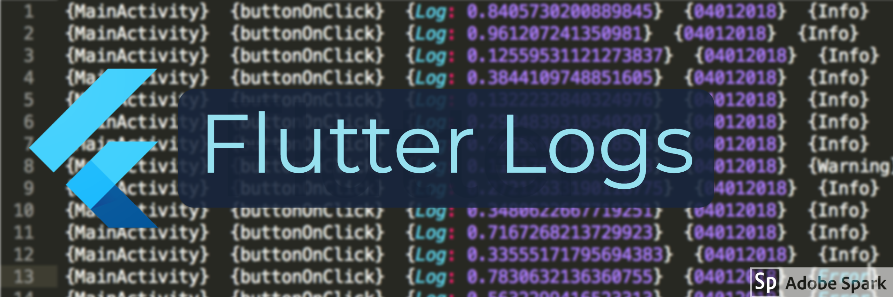

# flutter_logs
#### A file based advanced logging framework for Flutter Apps (Android).
##### iOS Support comming soon.

[](https://pub.dev/packages/flutter_logs)

Overview
--------

Flutter Logs provides quick & simple file based logging solution. All logs are saved to files in storage path provided. A new log file is created every hour on a new log event. These logs can be filtered and sorted easily. Logs can easily be exported as zip file base on filter type. PLogs also provide functionality to arrange data logs into a predefined directory structure. Custom logs can be used for a specific events based logging within the app. Logs can be saved as encrypted for security purposes. 

Flutter logs can work with Logstash by writing JSON delimited logs to log files. The format is based on ELK schema. You can also send logs in real-time to server using MQTT. MQTT configuration can be applied on Logstash to receive & view logs on kibana dashboard. 




Features
--------

- Logs events in files created separately every hour (24 hours event based)
- Files can be compressed and exported for time and day filters
- Clear Logs easily
- Save & Export Logs to custom path as zip file
- Custom Log formatting options
- CSV support
- Custom timestamps support
- Custom file data logging support.
- Encryption support added
- Multiple directory structures
- Print logs as String
- Export all or single types of logs
- XML configuration support for internal persistence
- ELK Stack Supported See more about it [here](https://www.elastic.co/what-is/elk-stack).
- MQTT Support (SSL)

## Install
In your pubspec.yaml

```yaml
dependencies:
  flutter_logs: [LATEST_VERSION]
```

```dart
import 'package:flutter_logs/flutter_logs.dart';
```

## How it works?

Hourly Logs
-----------

Hourly logs are autumatically generated once this line is called:

```dart

FlutterLogs.logThis(
        tag: 'MyApp',
        subTag: 'logData',
        logMessage:
            'This is a log message: ${DateTime.now().millisecondsSinceEpoch}',
        level: LogLevel.INFO);
```

This will create a new file in storage directory according to time on device. For a single date, all logs will be present in a single directory.

Custom File Logs
----------------

If you want to log data into a specific file for some events, you can do this in 2 steps:

#### Step 1: 
Define log file name in logs configuration:

```dart
    
    await FlutterLogs.initLogs(
        logTypesEnabled: ["Locations","Jobs","API"]);
 ```

 Here 3 files of logs are defined, logger will use these file name as keys to write data in them.      

#### Step 2: 
Log data to file. You can choose to either append to file or overwrite to complete file.

```dart
    
    FlutterLogs.logToFile(
        logFileName: "Locations",
        overwrite: false,
        logMessage:
            "{0.0,0.0}");
 ```

Export Logs
-----------

You can export logs to output path sepcified in logs configuration:

```dart
    
    await FlutterLogs.initLogs(
        logsExportDirectoryName: "MyLogs/Exported");
```

To export logs call this:

```dart
    
    FlutterLogs.exportLogs(
        exportType: ExportType.ALL, decryptBeforeExporting: true);
```

To export custom file logs:

```dart
    
 FlutterLogs.exportFileLogForName(
        logFileName: "Locations", decryptBeforeExporting: true);
```

Clear Logs
-----------

```dart
    
 FlutterLogs.clearLogs();
```

## Setting Up

#### Init Logs
_______________________________________________

```dart
    
    await FlutterLogs.initLogs(
        logLevelsEnabled: [
          LogLevel.INFO,
          LogLevel.WARNING,
          LogLevel.ERROR,
          LogLevel.SEVERE
        ],
        timeStampFormat: TimeStampFormat.TIME_FORMAT_READABLE,
        directoryStructure: DirectoryStructure.FOR_DATE,
        logTypesEnabled: [_my_log_file_name],
        logFileExtension: LogFileExtension.LOG,
        logsWriteDirectoryName: "MyLogs",
        logsExportDirectoryName: "MyLogs/Exported",
        debugFileOperations: true,
        isDebuggable: true);
```

#### ELK Elastic Stack Schema Support
_______________________________________________

Send additional Meta info for better filtering at LogStash dashboard. With this setting, logs will be logged as JSON-delemited.

```dart

    await FlutterLogs.setMetaInfo(
      appId: "flutter_logs_example",
      appName: "Flutter Logs Demo",
      appVersion: "1.0",
      language: "en-US",
      deviceId: "00012",
      environmentId: "7865",
      environmentName: "dev",
      organizationId: "5767",
      userId: "883023-2832-2323",
      userName: "umair13adil",
      userEmail: "m.umair.adil@gmail.com",
      deviceSerial: "YJBKKSNKDNK676",
      deviceBrand: "LG",
      deviceName: "LG-Y08",
      deviceManufacturer: "LG",
      deviceModel: "989892BBN",
      deviceSdkInt: "26",
      latitude: "0.0",
      longitude: "0.0",
      labels: "",
    );
```

Output of logs will be like this:

```json

{
  "user": {
    "user.email": "m.umair.adil@gmail.com",
    "user.full_name": "umair",
    "user.id": "17282738",
    "user.hash": "1",
    "user.name": "Umair"
  },
  "message": "{OkHttpClient}  {X-XSS-Protection: 1; mode=block} [30 June 2020 04:15:16 PM]",
  "@version": "1",
  "log.logger": "PLogger",
  "host": {
    "host.type": "Android",
    "host.name": "LG",
    "host.architecture": "LG 23",
    "host.hostname": "8000",
    "host.id": "LG",
    "host.ip": "0.0.0.0",
    "host.mac": ""
  },
  "labels": "{}",
  "app": {
    "app.language": "en-US",
    "app.id": "com.example.develop",
    "app.name": "Flutter Dev",
    "app.version": "0.0.108"
  },
  "process.thread.name": "DATA_LOG",
  "organization": {
    "organization.name": "debug",
    "organization.id": "BlackBox"
  },
  "geo": {
    "geo.location": "{ \"lon\": 0.0, \"lat\": 0.0 }"
  },
  "service.name": "Network",
  "@timestamp": "2020-06-30T16:27:36.894Z",
  "topic": "com.flutter.elk.logs",
  "log.level": "INFO"
}
```


#### Enable MQTT Feature
_______________________________________________

**Note:** PLogger currently supports SSL connection for MQTT.

#### Step 1: 
Add certificate in your assets directory.

##### Step 2: 
Add following line in your pubspec file.

```yml

flutter:
  assets:
     - m2mqtt_ca.crt

```

##### Step 3: 
Add following block for initializing MQTT logging.

```dart
        
    await FlutterLogs.initMQTT(
        topic: "YOUR_TOPIC",
        brokerUrl: "", //Add URL without schema
        certificate: "m2mqtt_ca.crt",
        port: "8883");
```

That's it, MQTT setup is done. If only MQTT feature is required then set this flag to false to stop writing logs to storage directory:

```dart
        
    await FlutterLogs.initMQTT(
        writeLogsToLocalStorage: false);
```

_______________________________________________

## Native Libraries

* For Android: [RxLogs](https://github.com/umair13adil/RxLogs) 

# Author

Flutter Logs plugin is developed by Umair Adil. You can email me at <m.umair.adil@gmail.com> for any queries.
