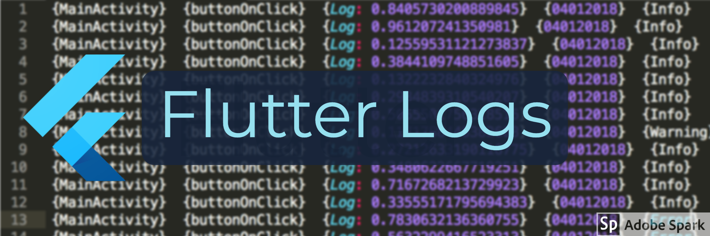
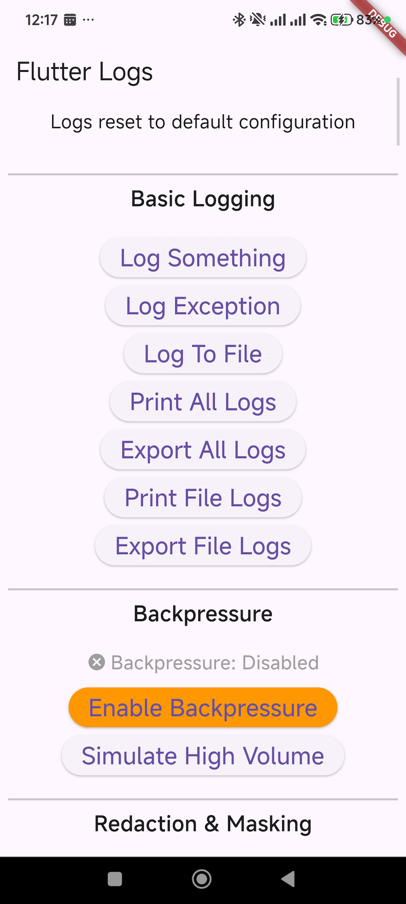
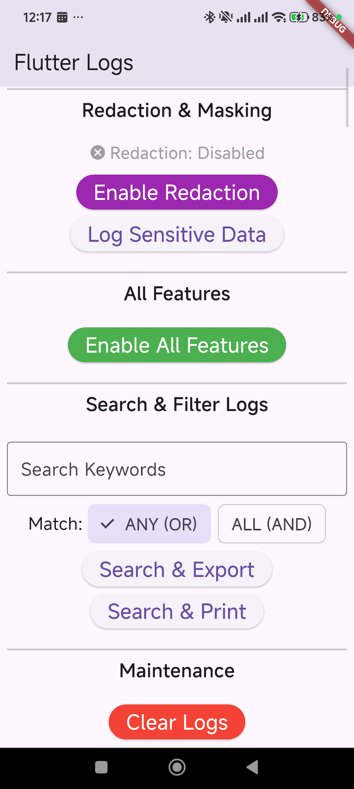
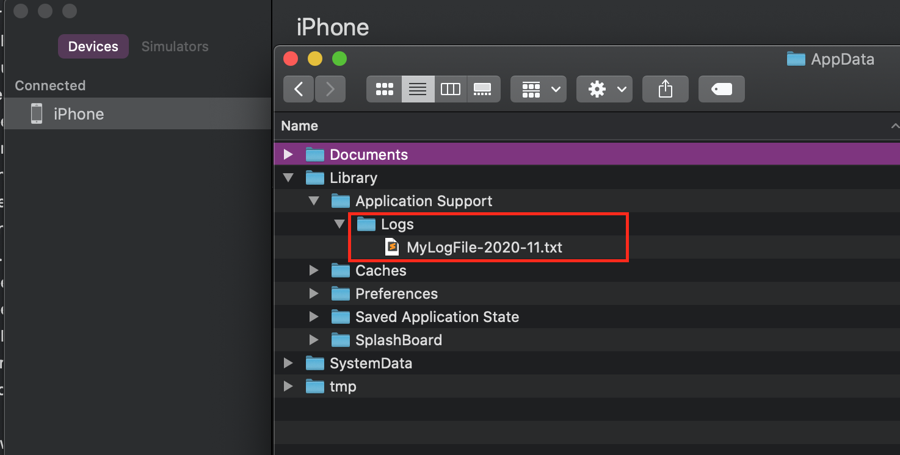

# flutter_logs
#### A file based advanced logging framework for Flutter Apps (Android & iOS).

[](https://pub.dev/packages/flutter_logs)

Overview
--------

Flutter Logs provides quick & simple file based logging solution. All logs are saved to files in storage path provided. A new log file is created every hour on a new log event. These logs can be filtered and sorted easily. Logs can easily be exported as zip file base on filter type. PLogs also provide functionality to arrange data logs into a predefined directory structure. Custom logs can be used for a specific events based logging within the app. Logs can be saved as encrypted for security purposes. 

Flutter logs can work with Logstash by writing JSON delimited logs to log files. The format is based on ELK schema. You can also send logs in real-time to server using MQTT. MQTT configuration can be applied on Logstash to receive & view logs on kibana dashboard. 



| Options 1 | Options 2 |
| :---: | :---: |
|  |  |


##### Read more about flutter_logs usage on this Medium article: 

[Sending logs from Flutter apps in real-time using ELK stack & MQTT](https://itnext.io/sending-logs-from-flutter-apps-in-real-time-using-elk-stack-mqtt-c24fa0cb9802)

Features (Android)
---------------------

- Logs events in files created separately every hour (24 hours event based)
- Files can be compressed and exported for time and day filters
- Clear Logs easily
- Save & Export Logs to app's directory as zip file
- Custom Log formatting options
- CSV support
- Custom timestamps support
- Custom file data logging support.
- Encryption support added
- Multiple directory structures
- Print logs as String
- Export all or single types of logs
- ELK Stack Supported See more about it [here](https://www.elastic.co/what-is/elk-stack).
- MQTT Support (SSL)
- **Backpressure support** for high-volume logging scenarios
- **Redaction & Masking** for sensitive data (PII protection)
- **Search & Filter** logs by keywords

Features (iOS)
------------------

##### *Note:* Work is in progress. More features will be added soon.

- Logs events in files
- Files can be compressed and exported
- Clear Logs easily
- Save & Export Logs to app's directory as zip file
- Print logs as String

## Install
In your pubspec.yaml

```yaml
dependencies:
    flutter_logs: [Latest]
```

```dart
import 'package:flutter_logs/flutter_logs.dart';
```

## Setting Up

#### Initialization
_______________________________________________

Call `FlutterLogs.initLogs` before `runApp`. Three parameters are required; everything else has a default.

```dart
import 'package:flutter_logs/flutter_logs.dart';

Future<void> main() async {
  WidgetsFlutterBinding.ensureInitialized();

  await FlutterLogs.initLogs(
    // --- required ---
    directoryStructure: DirectoryStructure.FOR_DATE,
    timeStampFormat: TimeStampFormat.TIME_FORMAT_READABLE,
    logFileExtension: LogFileExtension.LOG,

    // --- commonly set ---
    logLevelsEnabled: [
      LogLevel.INFO,
      LogLevel.WARNING,
      LogLevel.ERROR,
      LogLevel.SEVERE,
    ],
    logTypesEnabled: ["device", "network", "errors"],
    logsWriteDirectoryName: "MyLogs",
    logsExportDirectoryName: "MyLogs/Exported",
    logsRetentionPeriodInDays: 14,
    isDebuggable: true,
  );

  runApp(MyApp());
}
```

#### `initLogs` — Full Parameter Reference
_______________________________________________

| Parameter | Type | Default | Description |
|-----------|------|---------|-------------|
| `directoryStructure` | `DirectoryStructure` | **required** | How log files are arranged on disk. See values below. |
| `timeStampFormat` | `TimeStampFormat` | **required** | Timestamp format appended to each log entry. See values below. |
| `logFileExtension` | `LogFileExtension` | **required** | File extension for log files. See values below. |
| `logLevelsEnabled` | `List<LogLevel>?` | `null` (all) | Which log levels are written to file. Omit to enable all levels. |
| `logTypesEnabled` | `List<String>?` | `null` | Names of custom log-type files (used with `logToFile`). |
| `logsRetentionPeriodInDays` | `int` | `14` | Log files older than this are deleted automatically. |
| `zipsRetentionPeriodInDays` | `int` | `3` | Exported zip files older than this are deleted automatically. |
| `autoDeleteZipOnExport` | `bool` | `false` | Delete the zip file from the export directory after a successful export. |
| `autoClearLogs` | `bool` | `true` | Automatically clear log files when retention period expires. |
| `autoExportErrors` | `bool` | `true` | Automatically export `ERROR`/`SEVERE` logs when they occur. |
| `encryptionEnabled` | `bool` | `false` | Encrypt log files on disk. Requires `encryptionKey`. |
| `encryptionKey` | `String` | `""` | AES encryption key. Only used when `encryptionEnabled` is `true`. |
| `logSystemCrashes` | `bool` | `true` | Capture uncaught exceptions and log them automatically. |
| `isDebuggable` | `bool` | `true` | Print internal plugin debug messages to the console. |
| `debugFileOperations` | `bool` | `true` | Log file read/write operations to the console for tracing. |
| `attachTimeStamp` | `bool` | `true` | Prepend a timestamp to each log entry. |
| `attachNoOfFiles` | `bool` | `true` | Append the current file count to each log entry. |
| `zipFilesOnly` | `bool` | `false` | Export logs as a zip even when a single file would suffice. |
| `logsWriteDirectoryName` | `String` | `""` | Subdirectory name inside app storage where logs are written. |
| `logsExportZipFileName` | `String` | `""` | Custom name for the exported zip file (without extension). |
| `logsExportDirectoryName` | `String` | `""` | Subdirectory inside app storage where exported zips are placed. |
| `singleLogFileSize` | `int` | `2` | Maximum size of a single log file in MB before a new one is created. |
| `enabled` | `bool` | `true` | Master switch — set to `false` to disable all logging without changing config. |
| `forceWriteLogs` | `bool` | `true` | Write logs immediately even when the internal buffer is not full. |
| `enableLogsWriteToFile` | `bool` | `true` | Write log entries to files. Disable to log to console only. |
| `formatType` | `FormatType` | `FORMAT_CURLY` | Structure of each log entry. See values below. |
| `customFormatOpen` | `String` | `" "` | Opening delimiter used when `formatType` is `FORMAT_CUSTOM`. |
| `customFormatClose` | `String` | `" "` | Closing delimiter used when `formatType` is `FORMAT_CUSTOM`. |
| `logFilesLimit` | `int` | `100` | Maximum number of log files kept on disk before the oldest are removed. |
| `nameForEventDirectory` | `String` | `""` | Directory name for event logs. Used when `directoryStructure` is `FOR_EVENT`. |
| `autoExportLogTypes` | `List<String>?` | `null` | Log-type names that are exported automatically on a timer. |
| `autoExportLogTypesPeriod` | `int` | `0` | Interval in minutes between automatic exports. `0` disables the timer. |
| `csvDelimiter` | `String` | `""` | Column separator used when `formatType` is `FORMAT_CSV`. |
| `exportFormatted` | `bool` | `true` | Apply formatting rules when exporting (pretty-print). |
| `exportFileNamePreFix` | `String` | `""` | String prepended to the exported zip file name. |
| `exportFileNamePostFix` | `String` | `""` | String appended to the exported zip file name. |
| `backpressureConfig` | `BackpressureConfig?` | `null` | Queue and per-level quota settings for high-volume logging. See [Backpressure](#backpressure-support) below. |
| `redactionConfig` | `RedactionConfig?` | `null` | PII masking rules applied before writing each log entry. See [Redaction](#redaction--masking-pii-protection) below. |

#### Enum Values
_______________________________________________

**`DirectoryStructure`**

| Value | Description |
|-------|-------------|
| `FOR_DATE` | One directory per date, one file per hour inside it. |
| `FOR_EVENT` | All logs grouped into a single named event directory (`nameForEventDirectory`). |
| `SINGLE_FILE_FOR_DAY` | One log file per day. |

**`TimeStampFormat`**

| Value | Example output |
|-------|---------------|
| `DATE_FORMAT_1` | `2024-01-15` |
| `DATE_FORMAT_2` | `15-01-2024` |
| `TIME_FORMAT_FULL_JOINED` | `150120241030` |
| `TIME_FORMAT_FULL_1` | `15-01-2024 10:30:00` |
| `TIME_FORMAT_FULL_2` | `15/01/2024 10:30:00` |
| `TIME_FORMAT_24_FULL` | `2024-01-15 10:30:00` |
| `TIME_FORMAT_READABLE` | `15 January 2024 10:30 AM` |
| `TIME_FORMAT_READABLE_2` | `Jan 15, 2024 10:30 AM` |
| `TIME_FORMAT_SIMPLE` | `10:30:00` |

**`LogFileExtension`**

| Value | Extension |
|-------|-----------|
| `LOG` | `.log` |
| `TXT` | `.txt` |
| `CSV` | `.csv` |
| `NONE` | *(no extension)* |

**`LogLevel`**

| Value | Use for |
|-------|---------|
| `INFO` | General informational events |
| `WARNING` | Potentially harmful situations |
| `ERROR` | Error events that allow the app to continue |
| `SEVERE` | Critical failures |

**`FormatType`**

| Value | Entry format |
|-------|-------------|
| `FORMAT_CURLY` | `{tag} {message} {timestamp}` |
| `FORMAT_SQUARE` | `[tag] [message] [timestamp]` |
| `FORMAT_CSV` | Comma-separated (or `csvDelimiter`) columns |
| `FORMAT_CUSTOM` | Uses `customFormatOpen` / `customFormatClose` as delimiters |

**`ExportType`** *(used in export calls, not `initLogs`)*

| Value | Exports logs from |
|-------|------------------|
| `TODAY` | The current day |
| `LAST_HOUR` | The last 60 minutes |
| `LAST_24_HOURS` | The last 24 hours |
| `WEEKS` | The last 7 days |
| `ALL` | All retained log files |

## How to log data?

You have 2 choices for logging:

Hourly Logs
-----------

Hourly logs are automatically generated once this line is called. These logs are sorted and named according to current time (24h format) on device e.g. 0110202013.log 

```dart
FlutterLogs.logThis(
        tag: 'MyApp',
        subTag: 'logData',
        logMessage:
            'This is a log message: ${DateTime.now().millisecondsSinceEpoch}',
        level: LogLevel.INFO);
```

Or simply call this:

```dart
    FlutterLogs.logInfo("TAG", "subTag", "My Log Message");
    
    FlutterLogs.logWarn("TAG", "subTag", "My Log Message");
    
    FlutterLogs.logError("TAG", "subTag", "My Log Message");
    
    FlutterLogs.logErrorTrace("TAG", "subTag", "My Log Message", Error());
```

This will create a new file in storage directory according to time on device. For a single date, all logs will be present in a single directory.

Custom File Logs
-------------------

If you want to log data into a specific file for some events, you can do this in 2 steps:

These logs will be kept in a seperate file.

#### Step 1: 
[IMPORTANT] Define log file name in logs configuration, logger needs the name to find the file on storage, otherwise no data will be logged.

 Here 3 files of logs are defined, logger will use these file name as keys to write data in them.      
 
```dart
    await FlutterLogs.initLogs(
        logTypesEnabled: ["Locations","Jobs","API"]);
 ```

#### Step 2: 
Log data to file. You can choose to either append to file or overwrite to complete file.

```dart
    FlutterLogs.logToFile(
        logFileName: "Locations",
        overwrite: false,
        logMessage:
            "{0.0,0.0}");
 ```
 
Where are my logs stored?
 ------------------------------
 
 Your logs can be found in the path of your app's directory in storage:
 
 #### Android: 
 
*--> Android/data/[YOUR_APP_PACKAGE]/files/[YOUR_LOGS_FOLDER_NAME]/Logs/*
 
 
 
 #### iOS: 
 
 *--> [YOUR_APP_CONTAINER]/AppData/Library/Application Support/Logs/*
  
  
 

Export/Print Logs
---------------------

You can export logs to output path sepcified in logs configuration:

```dart
    await FlutterLogs.initLogs(
        logsExportDirectoryName: "MyLogs/Exported");
```

To export logs call this:

```dart
    FlutterLogs.exportLogs(
        exportType: ExportType.ALL);
```

```dart
    FlutterLogs.printLogs(
        exportType: ExportType.ALL);
```

To export custom file logs:

```dart
 FlutterLogs.exportFileLogForName(
        logFileName: "Locations");
```

```dart
 FlutterLogs.printFileLogForName(
        logFileName: "Locations");
```

### Listen to export/print results:
-------------------------------------------

```dart
    import 'dart:async';
    import 'dart:io';
    import 'package:flutter_logs/flutter_logs.dart';
    import 'package:path_provider/path_provider.dart';

    FlutterLogs.channel.setMethodCallHandler((call) async {
        if (call.method == 'logsExported') {
          var zipName = "${call.arguments.toString()}";

            Directory externalDirectory;

            if (Platform.isIOS) {
              externalDirectory = await getApplicationDocumentsDirectory();
            } else {
              externalDirectory = await getExternalStorageDirectory();
            }

            FlutterLogs.logInfo(TAG, "found", 'External Storage:$externalDirectory');

          File file = File("${externalDirectory.path}/$zipName");

          FlutterLogs.logInfo(
              TAG, "path", 'Path: \n${file.path.toString()}');

          if (file.existsSync()) {
            FlutterLogs.logInfo(
                TAG, "existsSync", 'Logs found and ready to export!');
          } else {
            FlutterLogs.logError(
                TAG, "existsSync", "File not found in storage.");
          }
          
        } else if (call.method == 'logsPrinted') {
          //TODO Get results of logs print here
        }
      });
```

### Exports logs manually
-------------------------------------------
Include dependency:

```yaml
         flutter_archive: ^6.0.3
```

```dart

       Directory? externalDirectory;
      
       if (Platform.isIOS) {
           externalDirectory = await getApplicationDocumentsDirectory();
       } else {
           externalDirectory = await getExternalStorageDirectory();
       }

      File file = File("${externalDirectory!.path}/$_logsDirectory");
      
      final zipFile = File("${externalDirectory.path}/logs.zip");
      try {
           await ZipFile.createFromDirectory(
           sourceDir: Directory(file.path),
           zipFile: zipFile,
           includeBaseDirectory: true);
      } catch (e) {
           print(e);
      }

      logInfo(_tag, "uploadFile", 'Storage:${file.path}, Zip: ${zipFile.path}');
}

```

Clear Logs
-----------

```dart
 FlutterLogs.clearLogs();
```

Errors/Exception Logs
---------------------

Printing exception logs:

```dart
      try {
          var i = 100 ~/ 0;
          print("$i");
      } catch (e) {
          FlutterLogs.logThis(
              tag: 'MyApp',
              subTag: 'Caught an exception.',
              logMessage: 'Caught an exception!',
              exception: e,
              level: LogLevel.ERROR);
      }
```

Printing error logs:

```dart
      try {
          var i = null;
          print(i * 10);
      } catch (e) {
          FlutterLogs.logThis(
              tag: 'MyApp',
              subTag: 'Caught an error.',
              logMessage: 'Caught an exception!',
              error: e,
              level: LogLevel.ERROR);
      }
```

Backpressure Support
---------------------

Backpressure helps manage high-volume logging scenarios by limiting queue size and setting quotas per log level to prevent memory issues and ensure critical logs are prioritized.

```dart
    await FlutterLogs.initLogs(
        // ... other configurations ...
        backpressureConfig: BackpressureConfig(
          queueCapacity: 500,        // Max logs in queue before dropping
          warnQueueCapacity: 400,    // Warn when queue reaches this size
          perLevelQuotas: {
            LogLevel.INFO: 100,      // Max 100 INFO logs per window
            LogLevel.WARNING: 50,    // Max 50 WARNING logs per window
            LogLevel.ERROR: 200,     // Prioritize error logs
            LogLevel.SEVERE: 200,    // Prioritize severe logs
          },
          quotaWindowMillis: 60000,  // 1 minute window for quotas
        ),
    );
```

Redaction & Masking (PII Protection)
---------------------

Automatically mask sensitive data like emails, phone numbers, credit cards, and custom patterns in your logs for privacy and security compliance.

#### Built-in Patterns

```dart
    await FlutterLogs.initLogs(
        // ... other configurations ...
        redactionConfig: RedactionConfig(
          enableBuiltInPatterns: {
            BuiltInPattern.EMAIL,        // Masks email addresses
            BuiltInPattern.PHONE_NUMBER, // Masks phone numbers
            BuiltInPattern.CREDIT_CARD,  // Masks credit card numbers
            BuiltInPattern.JWT_TOKEN,    // Masks JWT tokens
            BuiltInPattern.IP_ADDRESS,   // Masks IP addresses
          },
          defaultMaskType: MaskType.FULL_MASK,
        ),
    );
```

#### Custom Redaction Rules

You can define custom rules with regex patterns:

```dart
    await FlutterLogs.initLogs(
        // ... other configurations ...
        redactionConfig: RedactionConfig(
          enableBuiltInPatterns: {BuiltInPattern.EMAIL},
          customRules: [
            // Mask SSN patterns (XXX-XX-XXXX)
            RedactionRule(
              name: 'SSN',
              patternString: r'\b\d{3}-\d{2}-\d{4}\b',
              maskType: MaskType.FULL_MASK,
            ),
            // Partially mask API keys (show first 4 chars)
            RedactionRule(
              name: 'API_KEY',
              patternString: r'api_key[=:]\s*([A-Za-z0-9]{20,})',
              maskType: MaskType.PARTIAL,
            ),
            // Hash user IDs for tracking without exposing actual IDs
            RedactionRule(
              name: 'USER_ID',
              patternString: r'user_id[=:]\s*(\d+)',
              maskType: MaskType.HASH,
            ),
            // Custom replacement text
            RedactionRule(
              name: 'PASSWORD',
              patternString: r'password[=:]\s*\S+',
              maskType: MaskType.FULL_MASK,
              replacement: 'password=[REDACTED]',
            ),
          ],
          defaultMaskType: MaskType.FULL_MASK,
        ),
    );
```

#### Mask Types

| MaskType | Description | Example |
|----------|-------------|---------|
| `FULL_MASK` | Completely masks the value | `john@email.com` → `[REDACTED]` |
| `PARTIAL` | Shows partial value | `sk_live_abc123xyz` → `sk_l****` |
| `HASH` | Replaces with hash | `user_id=12345` → `user_id=[HASH:a1b2c3]` |

Search & Filter Logs
---------------------

Search through all log files for specific keywords and export or print only matching lines.

#### Export Filtered Logs

```dart
    FlutterLogs.exportFilteredLogs(
      keywords: ['ERROR', 'login', 'failed'],
      filterType: FilterType.OR,    // Match ANY keyword (use AND to match ALL)
      exportType: ExportType.ALL,
      ignoreCase: true,
    );
```

#### Print Filtered Logs

```dart
    FlutterLogs.printFilteredLogs(
      keywords: ['network', 'timeout'],
      filterType: FilterType.AND,   // Match ALL keywords
      exportType: ExportType.TODAY,
      ignoreCase: true,
    );
```

#### Filter Types

| FilterType | Description |
|------------|-------------|
| `FilterType.OR` | Match lines containing ANY of the keywords |
| `FilterType.AND` | Match lines containing ALL of the keywords |

#### ELK Elastic Stack Schema Support
_______________________________________________

Send additional Meta info for better filtering at LogStash dashboard. With this setting, logs will be logged as JSON-delemited.

```dart
    await FlutterLogs.setMetaInfo(
      appId: "flutter_logs_example",
      appName: "Flutter Logs Demo",
      appVersion: "1.0",
      language: "en-US",
      deviceId: "00012",
      environmentId: "7865",
      environmentName: "dev",
      organizationId: "5767",
      userId: "883023-2832-2323",
      userName: "umair13adil",
      userEmail: "m.umair.adil@gmail.com",
      deviceSerial: "YJBKKSNKDNK676",
      deviceBrand: "LG",
      deviceName: "LG-Y08",
      deviceManufacturer: "LG",
      deviceModel: "989892BBN",
      deviceSdkInt: "26",
      latitude: "0.0",
      longitude: "0.0",
      labels: {"env": "dev"},
    );
```

Output of logs will be like this:

```json
{
  "user": {
    "user.email": "m.umair.adil@gmail.com",
    "user.full_name": "umair",
    "user.id": "17282738",
    "user.hash": "1",
    "user.name": "Umair"
  },
  "message": "{OkHttpClient}  {X-XSS-Protection: 1; mode=block} [30 June 2020 04:15:16 PM]",
  "@version": "1",
  "log.logger": "PLogger",
  "host": {
    "host.type": "Android",
    "host.name": "LG",
    "host.architecture": "LG 23",
    "host.hostname": "8000",
    "host.id": "LG",
    "host.ip": "0.0.0.0",
    "host.mac": ""
  },
  "labels": "{}",
  "app": {
    "app.language": "en-US",
    "app.id": "com.example.develop",
    "app.name": "Flutter Dev",
    "app.version": "0.0.108"
  },
  "process.thread.name": "DATA_LOG",
  "organization": {
    "organization.name": "debug",
    "organization.id": "BlackBox"
  },
  "geo": {
    "geo.location": "{ \"lon\": 0.0, \"lat\": 0.0 }"
  },
  "service.name": "Network",
  "@timestamp": "2020-06-30T16:27:36.894Z",
  "topic": "com.flutter.elk.logs",
  "log.level": "INFO"
}
```


#### Enable MQTT Feature
_______________________________________________

**Note:** PLogger currently supports SSL connection for MQTT.

#### Step 1: 
Add certificate in your assets directory.

##### Step 2: 
Add following line in your pubspec file.

```yml
flutter:
  assets:
     - m2mqtt_ca.crt
```

##### Step 3: 
Add following block for initializing MQTT logging.

```dart 
    await FlutterLogs.initMQTT(
        topic: "YOUR_TOPIC",
        brokerUrl: "", //Add URL without schema
        certificate: "m2mqtt_ca.crt",
        port: "8883");
```

That's it, MQTT setup is done. If only MQTT feature is required then set this flag to false to stop writing logs to storage directory:

```dart
    await FlutterLogs.initMQTT(
        writeLogsToLocalStorage: false);
```

_______________________________________________

## Native Libraries

* For Android: [RxLogs](https://github.com/umair13adil/RxLogs) 
* For iOS [ZIPFoundation](https://github.com/weichsel/ZIPFoundation#zipping-files-and-directories)

For more details about RxLogs visit this [Wiki](https://github.com/umair13adil/RxLogs/wiki)

# Author

Flutter Logs plugin is developed by Umair Adil. You can email me at <m.umair.adil@gmail.com> for any queries.

# Support

Buy a coffe to [Umair Adil](https://twitter.com/umair13adil), creator of this plugin.

[](https://www.buymeacoffee.com/umairadil)
